# WaveX OS

> Open-source operating system for running an AI agent company on your localhost.

[](LICENSE)
[](docs/ROADMAP.md)
[](https://github.com/paperclip-ai/paperclip)

WaveX OS is a localhost-first wizard that materializes an AI agent company in about an hour. You answer five questions (the **5 pillars**), the wizard picks an agent roster from 165 vetted templates, builds a workflow plan, runs a Monte Carlo simulation against your goal, and activates the fleet into a real **Paperclip** runtime — where each agent gets heartbeats, KPIs, budgets, and a board.

Your data and inference stay on your machine. Spawned agents use your Claude Max OAuth via a wrapper that reads the system keychain — no API keys, no remote inference, no telemetry.

After the wizard you're on a **Mission Control** dashboard with a live fleet graph + KPI scoreboard. An optional **System Optimizer** subscription (Phase F) can inject board-level reasoning on a daily cadence using your same OAuth — code is free, hosted optimizer is a tier on top.

---

## Walkthrough — what you actually see

▶ **[Open the interactive walkthrough](https://htmlpreview.github.io/?https://github.com/aimerdoux/wavex-os/blob/main/docs/wizard.html)** — single-page wizard with autoplay, keyboard nav, and step-by-step captions. Source: [`docs/wizard.html`](docs/wizard.html) (no build step; open the file directly).

The screenshots below come straight out of the e2e suite — every one is the real wizard against a real `pnpm dev`. Reproducible via `pnpm test:e2e e2e/screenshot-walkthrough.spec.ts`.

| Step | Screen |
|---|---|
| **Start** — pick a company name (or resume a draft) | 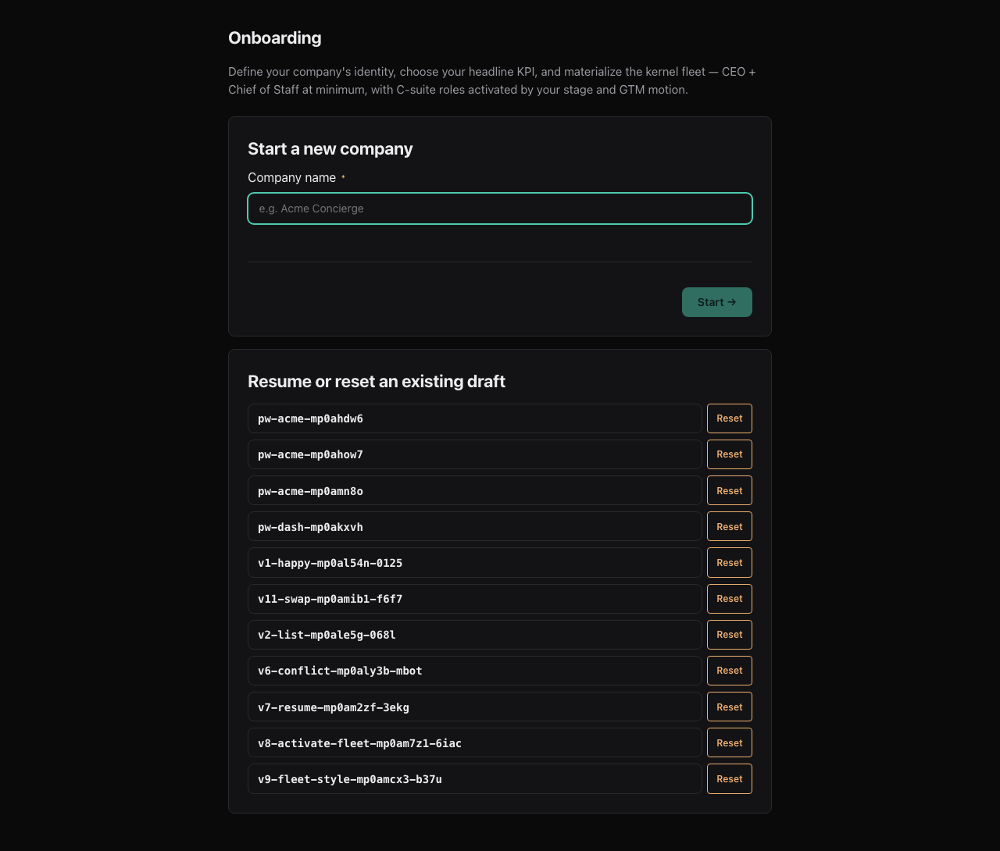 |
| **Pillar 1 — Who you are.** Tell the wizard what you're building, in plain text. T2 enrichment infers the 10 fields you'd otherwise type yourself. | 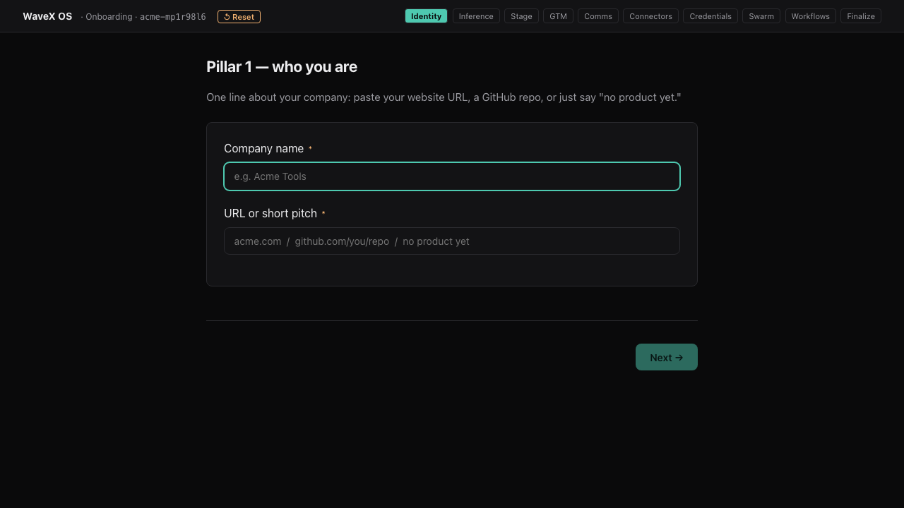 |
| **Pillar 1 confirm.** Review what was inferred + correct anything. The wizard signs the result and persists. | 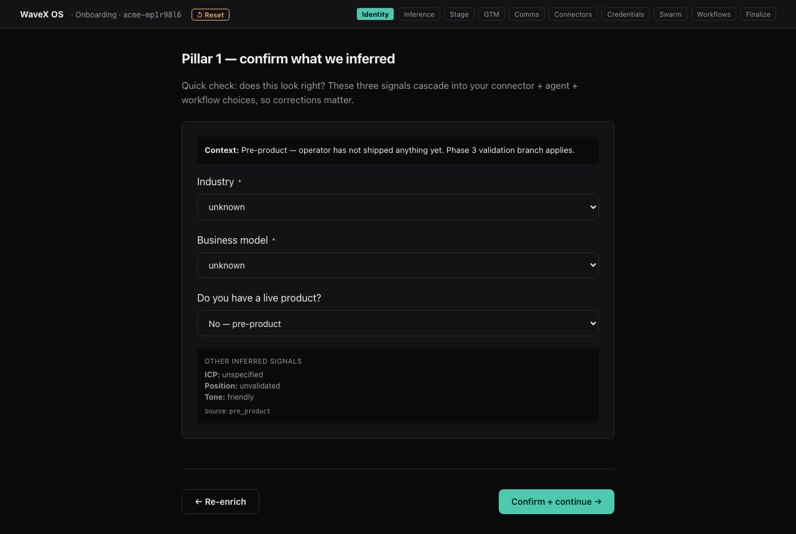 |
| **Pillar 2 — Setup verification.** Probes your local Claude CLI + plan tier. Defaults to Max 5×. | 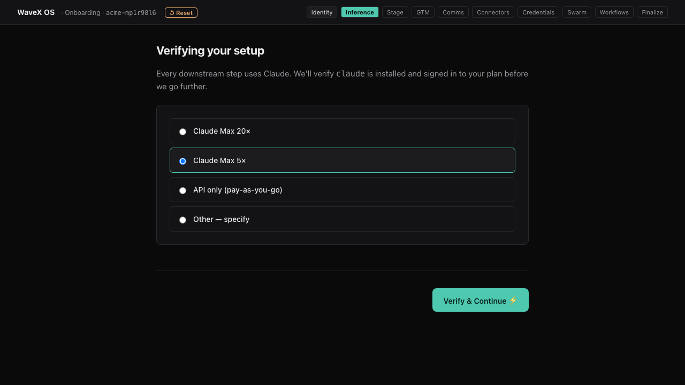 |
| **Pillar 3 — Product state.** Pre-product / live customers / 10K-100K MRR / etc. Drives matrix-based template selection. | 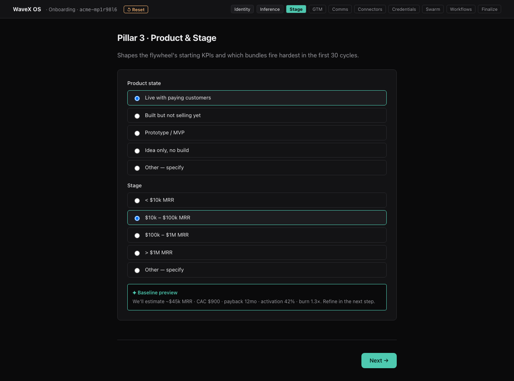 |
| **Pillar 4 — GTM motion.** Lead sources × sales motion → KPI tree shape. | 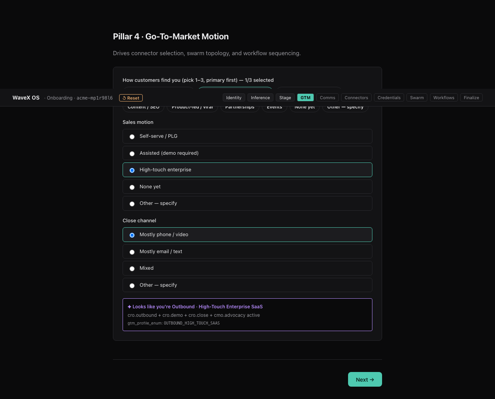 |
| **Pillar 5 — Comms.** Telegram, Slack, email — where board signals land. | 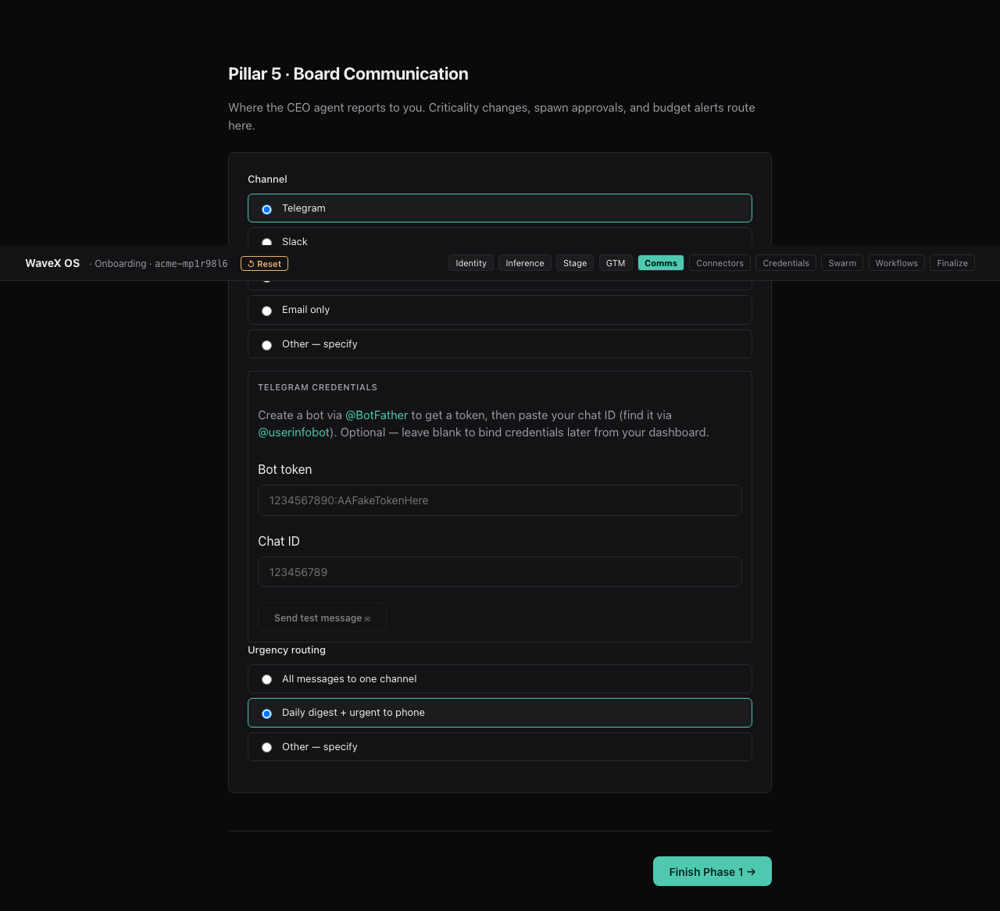 |
| **Phase 2 — Connectors.** Decision-matrix recommends required + suggested integrations based on your pillar answers. | 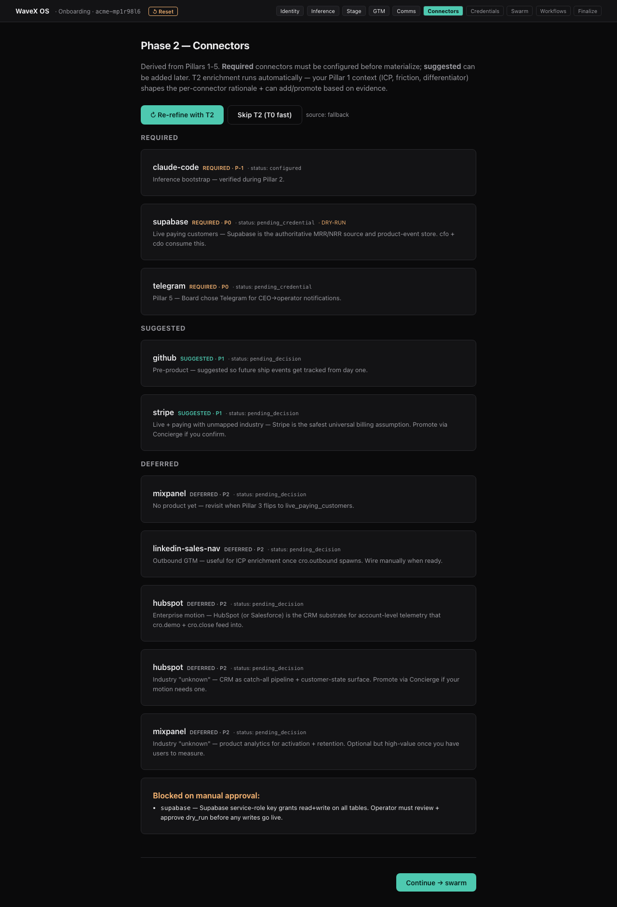 |
| **Credential Concierge.** Either paste OAuth tokens now, or click Skip per-connector. Vault encrypts everything before disk. | 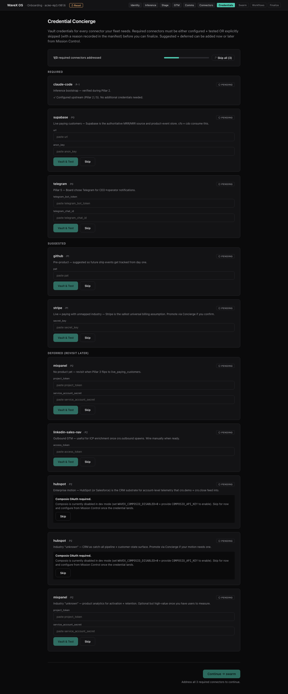 |
| **Phase 3 — Swarm.** Reactflow org chart of your generated roster. Drag, swap templates per slot, add specialist agents under any chief. | 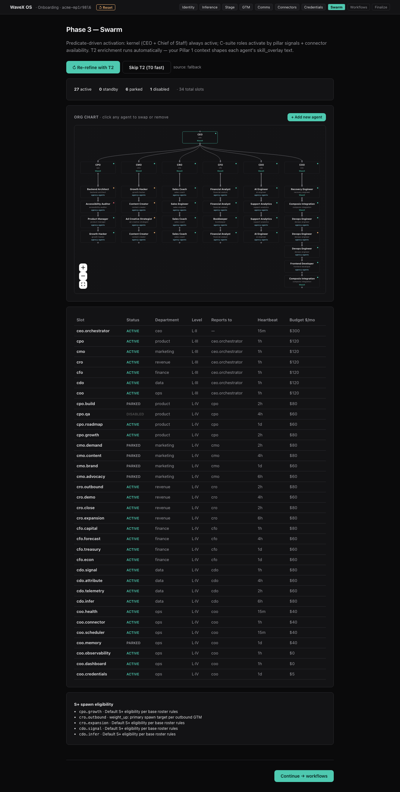 |
| **Phase 4 — Workflow.** Each agent's initial workload + bundle allocation. | 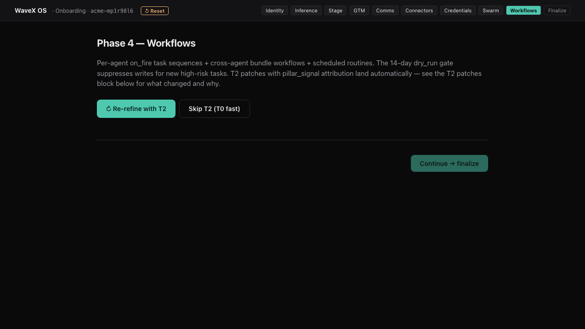 |
| **Finalize — Imprint + Monte Carlo.** Click *Finalize + sign*: the simulator projects KPI movement against your goal over N cycles. Signed company manifest written to disk. | 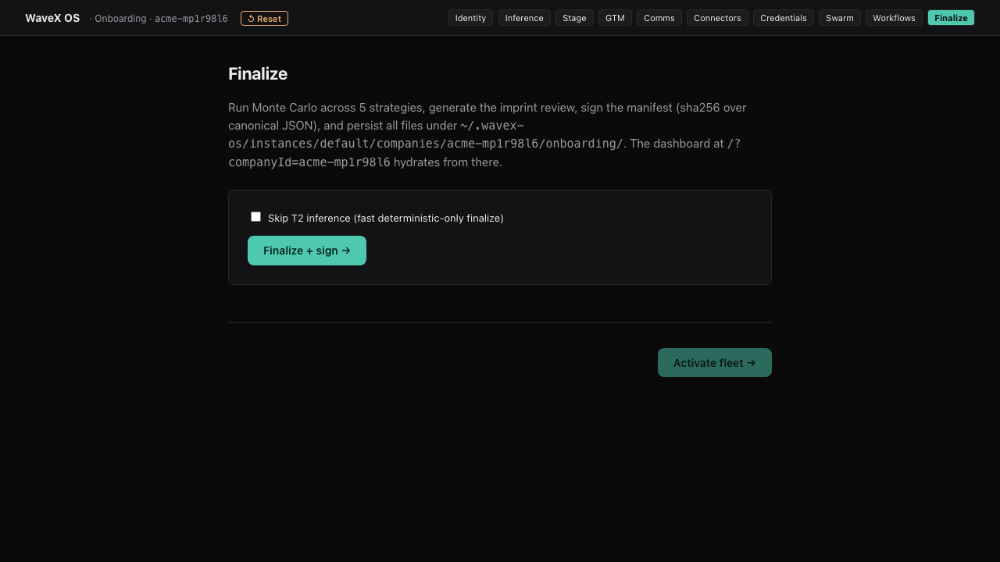 |
| **Summary before inception.** Imprint review + signed manifest summary. *Activate fleet →* enables once the signature lands. This is your last chance to inspect before agents go live. | 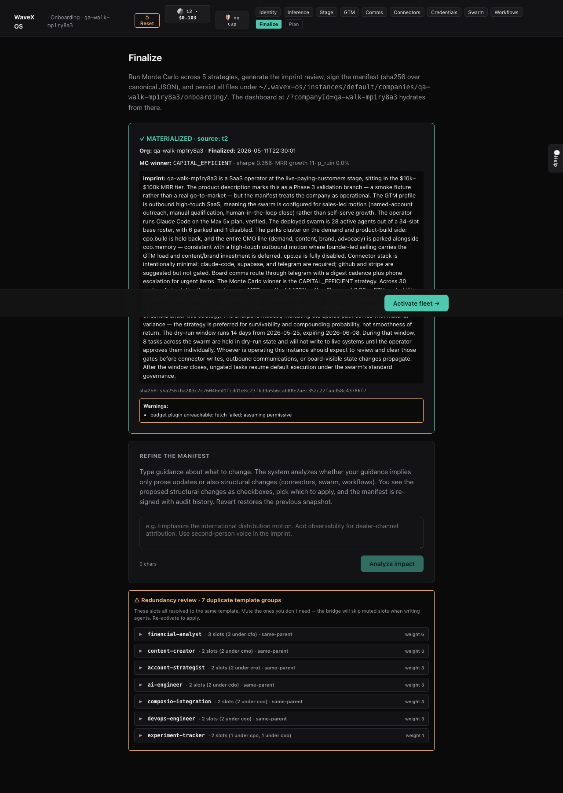 |
| **Mission Control — Paperclip live.** Activate hands the 35-agent fleet off to the running Paperclip instance and lands you here: KPI scoreboard + live reactflow fleet graph that polls every 8s. Click any agent to see runs, comments, budget. | 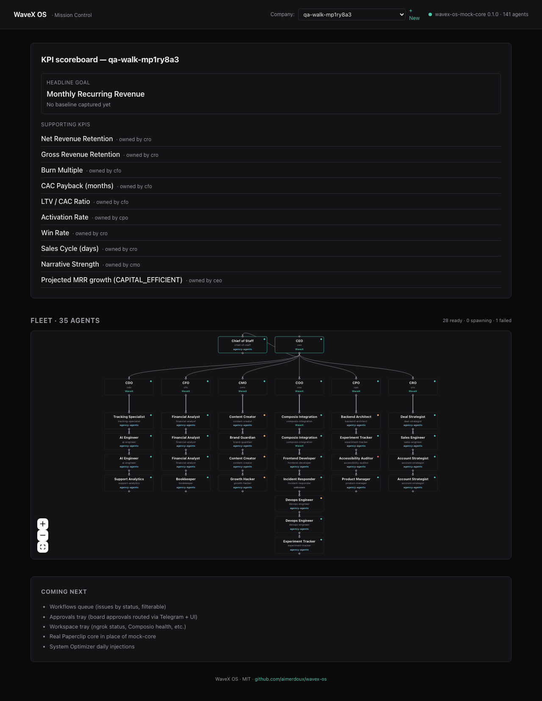 |

---

## What works today (v0.2.0)

### The wizard (5 pillars + 3 phases + finalize)

Owned by **op-omega** — a full-fidelity onboarding pipeline (12K LOC plugin + 2.4K LOC server + 5.4K LOC UI) vendored at [`vendor/op-omega/`](vendor/op-omega/). It does:

- **10-field Pillar 1 inference** with T2 enrichment + confirm/correct preview
- **Phase 2 decision matrix** for connector recommendation, with Composio fold-in when the live integration is configured
- **Phase 3 swarm generation** from a 33-slot base roster, **165 agent templates** (165 ingested via op-omega + WaveX-authored), and a matrix that overrides defaults based on stage + GTM
- **Phase 4 workflow allocation** with budget enforcement
- **Finalize** → signed `company.manifest.json` + Monte Carlo simulation

### The runtime (Paperclip-backed)

Activate hits [`POST /api/instance/:companyId/activate`](packages/op-omega-server/src/routes/activate.ts) which:

1. Bridges the signed manifest into the wavex DB (Drizzle, PGlite in dev / Postgres in prod) — companies + agents tables get their rows
2. Optionally **hands off the C-Suite to a running Paperclip instance** via [`paperclip-handoff.ts`](packages/op-omega-server/src/bridge/paperclip-handoff.ts) — opt-in via `PAPERCLIP_HANDOFF_URL`. Each agent gets:
   - The role's full vendored skill bundle as `AGENTS.md` (~60KB for CEO)
   - The company's auth wrapper as adapter `command`
   - `reportsTo` chain wired in dependency order
   - Auto-approval if Paperclip raised a board-approval gate

Once handed off, agents heartbeat every 5min via Paperclip's launchd timer, spawn `claude` CLI under the wrapper, post comments + KPI snapshots back to issues, and get observed by the fleet-observer.

### What v0.2.0 added (Phase H)

| Layer | What it does |
|---|---|
| **Minimal inception kernel** ([docs](docs/MINIMAL_INCEPTION.md)) | CEO + Chief of Staff as the only required agents — exhibits coherent self-direction with one actor + one observer. C-suite is opt-in via Pillar 3 + 4 answers. |
| **Standard cross-cutting skills** ([packages/standard-skills/](packages/standard-skills/)) | Six skill files every agent loads at heartbeat start: economic self-awareness, verify-before-claim, KPI ownership, harness recognition, lessons read, delegate-or-kill. |
| **Self-healing reference impl** ([packages/healing/](packages/healing/)) | Layer 1 (wrapper 401 self-heal + Sonnet fallback), Layer 2 (OAuth refresh with concurrency lock + invalid_grant retry), Layer 3 (worker restart with SIGTERM→SIGKILL). |
| **Observability reference impl** ([packages/observability/](packages/observability/)) | Bottleneck scoring, outcome attribution, token budget + adaptive throttle, mission-control aggregator, fleet-observer markdown synthesis. |
| **Operations** ([templates/launchd/](templates/launchd/), [scripts/](scripts/)) | Six launchd templates (recovery-on-boot, recovery-12h, fleet-assessment, economics-refresh, attribution-sweep, bottleneck-digest). Sample provisioning scripts for the Chief of Staff and KPI registry. |
| **Paperclip handoff bridge** ([packages/op-omega-server/src/bridge/paperclip-handoff.ts](packages/op-omega-server/src/bridge/paperclip-handoff.ts)) | After bridgeAgents, mirror the C-Suite into a running Paperclip instance. Idempotent via on-disk mapping; auto-creates the Paperclip company + auto-approves hires. |

After Phase H, **fleet burn dropped 96%** on the production deployment that produced this release. Single-agent burn dropped 95% on the heaviest agent. Spinner patterns became visible and auto-pauseable in one click.

See [docs/ROADMAP.md](docs/ROADMAP.md) for the phase plan and [docs/ARCHITECTURE.md](docs/ARCHITECTURE.md) for the design.

---

## Quickstart

You need [Node ≥18](https://nodejs.org), [pnpm ≥8](https://pnpm.io), [git](https://git-scm.com), and a [Claude Max](https://claude.ai/upgrade) subscription on the same machine (the wizard reads from the system keychain).

```bash
git clone https://github.com/aimerdoux/wavex-os.git
cd wavex-os
pnpm install
pnpm -r --filter "./vendor/op-omega/*" build   # build the vendored op-omega packages
pnpm dev
```

This boots two servers in parallel:

- `http://localhost:5173` — onboarding wizard + Mission Control (Vite + React)
- `http://localhost:3101` — `mock-core` (Fastify, hosts `/api/*` + op-omega routes)

Open [http://localhost:5173](http://localhost:5173) and you'll land on Mission Control. Click **Start onboarding** to begin the wizard.

### Optional — hand off to a running Paperclip instance

If you've got Paperclip running locally, point WaveX OS at it and the wizard's activate step will also hire your C-Suite as real Paperclip agents:

```bash
PAPERCLIP_HANDOFF_URL=http://127.0.0.1:3100 \
PAPERCLIP_HANDOFF_WRAPPER=/abs/path/to/claude-anthropic-direct.sh \
  pnpm dev
```

Without those env vars, activate writes to the wavex DB only — the agents exist as rows but don't run heartbeats. With them, the full inception loop closes.

> **`npx wavex-os init`** ships from `apps/installer/` — Phase F will publish it to npm. For now, `pnpm dev` is the supported path.

---

## What's in the box

```
wavex-os/
├── apps/installer/                       # npx wavex-os init CLI (doctor + spawn dev:full)
├── packages/
│   ├── core/                             # Paperclip vendored via git subtree
│   ├── db/                               # PGlite (dev) / Postgres (prod) + Drizzle schema
│   ├── plugin-sdk-shim/                  # Re-exports @paperclipai/plugin-sdk surface
│   ├── auth-shim/                        # assertBoard / assertCompanyAccess gates
│   ├── composio-shim/                    # listConnections + featured toolkits
│   ├── inference-adapter/                # tier-router claudeBin (OAuth vs API key mode)
│   ├── op-omega-server/                  # Fastify routes for vendored onboarding + activate + handoff
│   ├── onboarding-ui/                    # Vite + React wizard + Mission Control v2
│   │   └── public/agent-templates/       # 165 role-specific skill packs (CEO, CoS, CMO, CRO, …)
│   ├── mock-core/                        # In-memory stand-in for Paperclip; Fastify on :3101
│   ├── standard-skills/                  # Cross-cutting skills every agent loads
│   ├── healing/                          # OAuth refresh + worker restart reference impl
│   ├── observability/                    # bottlenecks, attribution, budget, mission-control
│   └── onboarding-server-client/         # Typed stub for future hosted backend
├── vendor/op-omega/                      # vendored op-omega @ d84983a1 (2026-05-03)
│   ├── plugin-sdk/                       # @paperclipai/plugin-sdk
│   ├── shared/                           # @paperclipai/shared
│   ├── tier-router/                      # @op-omega/plugin-tier-router
│   ├── flywheel-kernel/                  # @op-omega/plugin-flywheel-kernel
│   ├── onboarding/                       # @op-omega/plugin-onboarding (50 src files)
│   └── VENDOR.md                         # source SHA + vendor exceptions + update procedure
├── scripts/
│   ├── wrappers/
│   │   ├── claude-anthropic-direct.sh    # macOS keychain → OAuth wrapper
│   │   └── claude-spawn.sh               # Per-spawn execution wrapper with 401 self-heal
│   ├── render-launchd-templates.mjs      # Materialize launchd plists
│   ├── provision-chief-of-staff.sample.mjs   # Kernel completion
│   └── setup-hierarchy-and-kpis.sample.mjs   # Hierarchy + KPI registration
├── templates/launchd/                    # 6 .plist.tmpl with placeholders
├── examples/                             # config + KPI registry samples
├── docs/
│   ├── ARCHITECTURE.md
│   ├── CLAUDE_MAX_HANDOFF.md
│   ├── MINIMAL_INCEPTION.md
│   ├── SELF_HEALING.md
│   ├── ROADMAP.md
│   ├── onboarding/migration-plan.md
│   ├── ops/surface-tuning-map.md         # 40 tunables (auto-generated)
│   └── images/wizard/                    # The screenshots in this README
└── e2e/
    ├── onboarding.spec.ts                # full wizard walk
    ├── flow-variants.spec.ts             # 11 variants (reset, resume, swap, conflict, …)
    ├── bug-hunt.spec.ts                  # 14 composition + edge-case scenarios
    ├── dashboard.spec.ts                 # Mission Control behavior
    ├── screenshot-walkthrough.spec.ts    # capture for this README
    └── screenshot-mission-control.spec.ts
```

---

## Architecture

```
       ┌──── localhost (your machine) ─────────────────────────────────┐
       │                                                                │
       │  Browser  ──HTTP──▶  Vite UI  ──proxy──▶  mock-core (3101)    │
       │                       (5173)                  │                 │
       │                                                ▼                 │
       │                                         macOS Keychain           │
       │                                  via wavex-claude wrapper         │
       │                          (token never leaves this box)            │
       │                                                                   │
       │                       (optional) ──HTTP──▶  Paperclip (3100)     │
       │                                              │ heartbeats,        │
       │                                              │ claude CLI,        │
       │                                              │ KPI snapshots,     │
       │                                              ▼ fleet-observer     │
       │                                         your live agents          │
       └────────────────────────────────────────────────────────────────┘
                                       ▲
                                       │  Phase F: optional, paid
                                       │  System Optimizer cron pulls
                                       │  KPI digest, posts board-level
                                       │  injection back as a comment
                                       ▼
                            api.wavex-os.com  (planned)
```

Three design principles:

1. **Your data, your inference.** Spawned agents use *your* Claude Max plan via the wrapper. Token never crosses the wire.
2. **Open-source first, paid optimizer second.** The full local product is MIT. Hosted optimizer is a tier on top.
3. **Subtractive over additive.** Every phase has a single exit criterion. We cut features that don't pull their weight.

Full design: [docs/ARCHITECTURE.md](docs/ARCHITECTURE.md). OAuth handoff details: [docs/CLAUDE_MAX_HANDOFF.md](docs/CLAUDE_MAX_HANDOFF.md). Paperclip integration: [packages/op-omega-server/src/bridge/paperclip-handoff.ts](packages/op-omega-server/src/bridge/paperclip-handoff.ts).

---

## Pricing

- **Code:** free, MIT, fork it.
- **System Optimizer (optional cloud subscription, Phase F):**
  - Trial — 14 days free
  - Founder — $29/mo (1 daily injection, 500K tokens/mo)
  - Growth — $99/mo (hourly during business hours, 2M tokens, on-demand asks)
  - Custom — $299/mo (unlimited, dedicated optimizer)

You can self-host the optimizer too — `docs/SELF_HOSTING.md` lands with Phase F.

---

## Credits

WaveX OS stands on the shoulders of:

- **[Paperclip](https://github.com/paperclip-ai/paperclip)** — the agent runtime engine, vendored via git subtree at `packages/core/`.
- **[op-omega](https://github.com/dylanriedw10-oss/operatoromega)** — the full-fidelity onboarding pipeline, vendored at `vendor/op-omega/` (source SHA tracked in [VENDOR.md](vendor/op-omega/VENDOR.md)).
- **[agency-agents](https://github.com/msitarzewski/agency-agents)** by [@msitarzewski](https://github.com/msitarzewski) — 207 agent templates (MIT). 165 templates are vendored into `packages/onboarding-ui/public/agent-templates/` with per-file attribution.
- **[Anthropic](https://anthropic.com)** — Claude Max powers the spawned agents.
- **[reactflow](https://reactflow.dev)** — drives the onboarding swarm chart and the Mission Control fleet graph.
- **[Fastify](https://fastify.dev)** — the mock-core + op-omega-server HTTP layer.

Full attribution: [CREDITS.md](CREDITS.md).

---

## Status

**v0.2.0 — Phase H** (Minimal inception kernel + four-layer self-healing). Production patterns from a 7-day deployment crystallized into open-source skills, services, and operational templates. Phase D (Paperclip handoff bridge) just shipped in this commit. Phase E completes OAuth handoff (Linux + Windows). Phase F adds Stripe + the hosted Optimizer.

See [docs/ROADMAP.md](docs/ROADMAP.md) for the full plan and what's done.

---

## License

MIT. See [LICENSE](LICENSE).
